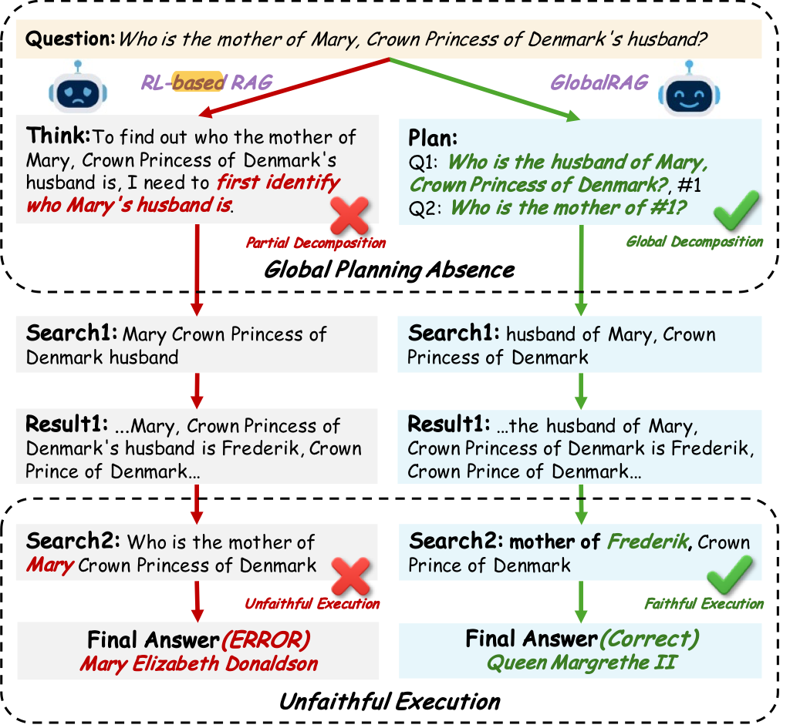
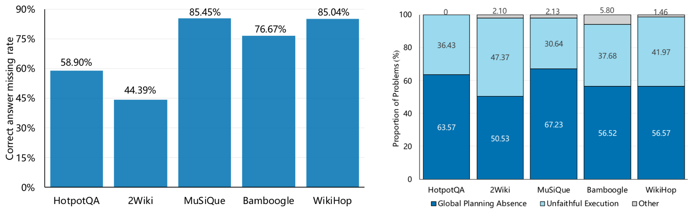
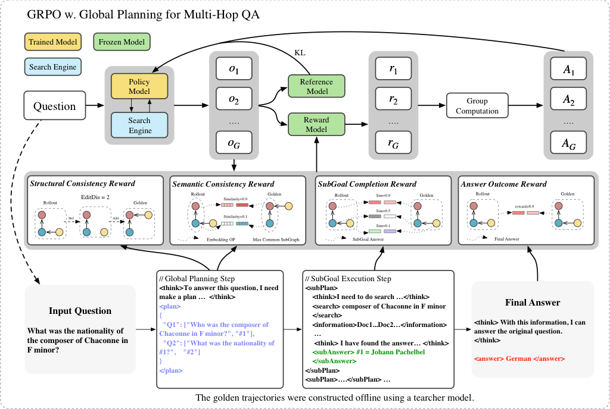
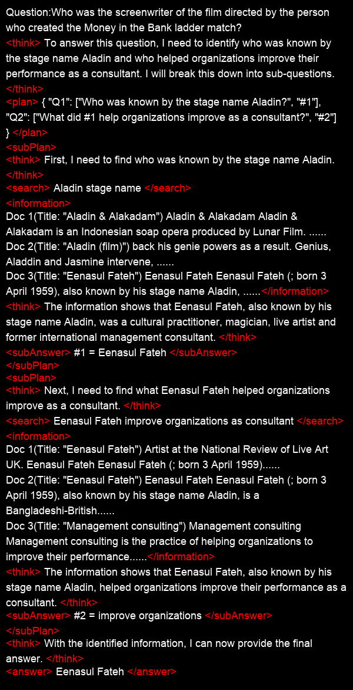

<h1 align="center">🚀🚀🚀 <b>GlobalRAG</b>: Enhancing <b><i>Global</i></b> Reasoning in Multi-hop Question Answering via Reinforcement Learning</h1>


**GlobalRAG** is a reinforcement learning framework designed for **multi-hop question answering**. It decomposes complex questions into **sub-goals**, enabling coordinated retrieval and reasoning while **iteratively optimizing evidence utilization**.
To foster **global planning** and **reliable execution**, the framework introduces two complementary reward signals — a *planning quality reward* and a *sub-goal completion reward*. These jointly balance **process-oriented** and **outcome-oriented** objectives through **progressive weight annealing**.

Built upon [Search-R1](https://github.com/PeterGriffinJin/Search-R1), **GlobalRAG** extends its **multi-hop reasoning** capabilities with a **structured reinforcement signal** that explicitly models planning quality.

<p align="center">
          🤗 <a href="https://huggingface.co/Carnegie-Bin">Models</a>&nbsp&nbsp | &nbsp&nbsp📑 <a href="https://arxiv.org/abs/2510.20548">Paper</a>&nbsp&nbsp 
</p>

## ⭐️ Features

* 📝 Introduces a novel QA framework that explicitly models global reasoning, enabling the model to plan before retrieving information.

* 🧩 Enhances multi-hop question answering through dense process supervision and reinforcement learning to improve reasoning accuracy and coherence.

* 📈 Achieves **+14.2 EM/F1 improvement** over leading methods on benchmark datasets including **2Wiki, HotpotQA, Musique, Bamboogle, and Wikihop**.

<table border="1" cellspacing="0" cellpadding="4">
  <tr>
    <th rowspan="2">Methods</th>
    <th colspan="2">HotpotQA</th>
    <th colspan="2">2Wiki</th>
    <th colspan="2">MuSiQue</th>
    <th colspan="2">Bamboogle</th>
    <th colspan="2">WikiHop</th>
    <th colspan="2">Avg</th>
  </tr>
  <tr>
    <th>EM</th>
    <th>F1</th>
    <th>EM</th>
    <th>F1</th>
    <th>EM</th>
    <th>F1</th>
    <th>EM</th>
    <th>F1</th>
    <th>EM</th>
    <th>F1</th>
    <th>EM</th>
    <th>F1</th>
  </tr>

  <tr>
    <td style="white-space: nowrap;"><b>Qwen2.5-3b-Base/Instruct</b></td>
    <td colspan="12"></td>
  </tr>
  <tr>
    <td style="white-space: nowrap;">Zero-Shot</td>
    <td>1.2</td><td>3.3</td>
    <td>1.6</td><td>2.7</td>
    <td>0.0</td><td>1.2</td>
    <td>0.0</td><td>1.9</td>
    <td>0.1</td><td>0.7</td>
    <td>0.6</td><td>2.0</td>
  </tr>
  <tr>
    <td style="white-space: nowrap;">NaiveRAG</td>
    <td>6.5</td><td>13.8</td>
    <td>2.2</td><td>4.1</td>
    <td>0.5</td><td>1.9</td>
    <td>4.0</td><td>8.5</td>
    <td>2.8</td><td>7.6</td>
    <td>3.2</td><td>7.2</td>
  </tr>
  <tr>
    <td style="white-space: nowrap;">IRCOT</td>
    <td>4.8</td><td>11.2</td>
    <td>3.0</td><td>8.6</td>
    <td>0.9</td><td>3.2</td>
    <td>5.6</td><td>10.1</td>
    <td>2.8</td><td>6.3</td>
    <td>3.4</td><td>7.9</td>
  </tr>
  <tr>
    <td style="white-space: nowrap;">Search-o1</td>
    <td>14.6</td><td>22.1</td>
    <td>14.0</td><td>17.0</td>
    <td>3.6</td><td>7.7</td>
    <td>26.4</td><td>34.9</td>
    <td>5.3</td><td>10.3</td>
    <td>12.8</td><td>18.4</td>
  </tr>
  <tr>
    <td style="white-space: nowrap;">Search-R1-base</td>
    <td>26.8</td><td>36.7</td>
    <td>25.6</td><td>29.2</td>
    <td>2.5</td><td>7.3</td>
    <td>11.2</td><td>20.4</td>
    <td>9.3</td><td>16.5</td>
    <td>15.1</td><td>22.0</td>
  </tr>
  <tr>
    <td style="white-space: nowrap;">Search-R1-instruct</td>
    <td>31.3</td><td>41.5</td>
    <td>31.3</td><td>36.5</td>
    <td>7.7</td><td>13.2</td>
    <td>28.0</td><td>34.7</td>
    <td>8.2</td><td>13.8</td>
    <td>21.3</td><td>27.9</td>
  </tr>
  <tr>
    <td style="white-space: nowrap;">StepSearch-base</td>
    <td>29.1</td><td>40.3</td>
    <td>33.5</td><td>38.7</td>
    <td>10.4</td><td>17.7</td>
    <td>32.8</td><td>41.8</td>
    <td>13.5</td><td>19.6</td>
    <td>23.9</td><td>31.6</td>
  </tr>
  <tr>
    <td style="white-space: nowrap;">StepSearch-instruct</td>
    <td>28.9</td><td>39.9</td>
    <td>31.9</td><td>38.3</td>
    <td>9.5</td><td>16.6</td>
    <td>32.0</td><td>43.8</td>
    <td>11.2</td><td>18.1</td>
    <td>22.7</td><td>31.3</td>
  </tr>
  <tr>
    <td style="white-space: nowrap;"><b>GlobalRAG-base</b></td>
    <td>30.4</td><td>41.0</td>
    <td>43.1</td><td>48.3</td>
    <td>11.3</td><td>17.4</td>
    <td>40.0</td><td>49.5</td>
    <td>12.7</td><td>19.7</td>
    <td>27.5</td><td>35.2</td>
  </tr>
  <tr>
    <td style="white-space: nowrap;"><b>GlobalRAG-instruct</b></td>
    <td>32.9</td><td>44.2</td>
    <td>42.3</td><td>47.8</td>
    <td>10.8</td><td>18.6</td>
    <td>37.6</td><td>49.3</td>
    <td>12.9</td><td>20.7</td>
    <td>27.3</td><td>36.1</td>
  </tr>

  <tr>
    <td style="white-space: nowrap;"><b>Qwen2.5-7b-Base/Instruct</b></td>
    <td colspan="12"></td>
  </tr>
  <tr>
    <td style="white-space: nowrap;">Search-R1-base</td>
    <td>28.5</td><td>38.3</td>
    <td>26.7</td><td>31.3</td>
    <td>7.1</td><td>12.9</td>
    <td>35.2</td><td>43.1</td>
    <td>11.4</td><td>17.4</td>
    <td>21.8</td><td>28.6</td>
  </tr>
  <tr>
    <td style="white-space: nowrap;">Search-R1-instruct</td>
    <td>35.9</td><td>47.5</td>
    <td>33.4</td><td>39.5</td>
    <td>9.7</td><td>16.7</td>
    <td>43.4</td><td>52.7</td>
    <td>15.5</td><td>23.0</td>
    <td>27.6</td><td>35.9</td>
  </tr>
  <tr>
    <td style="white-space: nowrap;">StepSearch-base</td>
    <td>33.5</td><td>43.5</td>
    <td>39.1</td><td>44.8</td>
    <td>13.1</td><td>22.1</td>
    <td>42.4</td><td>52.4</td>
    <td>16.9</td><td>24.6</td>
    <td>29.0</td><td>37.5</td>
  </tr>
  <tr>
    <td style="white-space: nowrap;">StepSearch-instruct</td>
    <td>34.8</td><td>46.9</td>
    <td>36.3</td><td>42.5</td>
    <td>13.4</td><td>21.4</td>
    <td>41.6</td><td>53.1</td>
    <td>14.9</td><td>22.3</td>
    <td>28.2</td><td>37.2</td>
  </tr>
  <tr>
    <td style="white-space: nowrap;"><b>GlobalRAG-base</b></td>
    <td>33.0</td><td>44.4</td>
    <td>47.0</td><td>52.4</td>
    <td>14.2</td><td>22.7</td>
    <td>46.4</td><td>51.0</td>
    <td>16.0</td><td>22.7</td>
    <td>31.3</td><td>38.6</td>
  </tr>
  <tr>
    <td style="white-space: nowrap;"><b>GlobalRAG-instruct</b></td>
    <td>38.2</td><td>50.7</td>
    <td>47.8</td><td>53.2</td>
    <td>14.9</td><td>21.2</td>
    <td>48.8</td><td>61.6</td>
    <td>19.0</td><td>28.0</td>
    <td>33.7</td><td>42.9</td>
  </tr>
</table>


[//]: # (<p align="center">)

[//]: # (  )

[//]: # (</p>)


[//]: # (<p align="center">)

[//]: # (  )

[//]: # (</p>)


## 🔄&nbsp;Framework

<p align="center">
  
</p>


## 📰&nbsp;News


- [2025.11] We opensource GlobalRAG checkpoint.
- [2025.11] We opensource GlobalRAG train and test data.
- [2025.11] We opensource GlobalRAG code.


## ⚙️&nbsp;Installation

### GlobalRAG environment (fork from Search-R1)
```bash
conda create -n globalrag python=3.9
conda activate globalrag
# install torch [or you can skip this step and let vllm to install the correct version for you]
pip install torch==2.4.0 --index-url https://download.pytorch.org/whl/cu121
# install vllm
pip3 install vllm==0.6.3 # or you can install 0.5.4, 0.4.2 and 0.3.1

# verl
pip install -e .

# flash attention 2
pip3 install flash-attn --no-build-isolation
pip install swanlab
```

### Retriever environment (optional)
If you would like to call a local retriever as the search engine, you can install the environment as follows. (We recommend using a seperate environment.)
```bash
conda create -n retriever python=3.10
conda activate retriever

# we recommend installing torch with conda for faiss-gpu
conda install pytorch==2.4.0 torchvision==0.19.0 torchaudio==2.4.0 pytorch-cuda=12.1 -c pytorch -c nvidia
pip install transformers datasets pyserini

## install the gpu version faiss to guarantee efficient RL rollout
conda install -c pytorch -c nvidia faiss-gpu=1.8.0

## API function
pip install uvicorn fastapi
```


## ▶️&nbsp;Quick start

Train a reasoning + search LLM  with e5 as the retriever and wikipedia as the corpus.

(1) Download the indexing and corpus.
```bash
save_path=/the/path/to/save
python scripts/download.py --save_path $save_path
cat $save_path/part_* > $save_path/e5_Flat.index
gzip -d $save_path/wiki-18.jsonl.gz
```

(2) Process the dataset for training.

First, download the original dataset from Hugging Face: [https://huggingface.co/datasets/GenIRAG/PER-PSE
] and place it in the ```GlobalRAG-data``` directory. 
Then, run the following script to generate the training data:
```bash
python scripts/data.py
```

(3) Launch a local retrieval server.
```bash
conda activate retriever
bash retrieval_launch.sh
```

(4) Run RL training (GRPO) on GlobalRAG.
```bash
conda activate globalrag
bash scripts/train_grpo_3B.sh
```

## 🤔&nbsp;Inference
(1) Launch a local retrieval server.
```bash
conda activate retriever
bash retrieval_launch.sh
```

(2) Processing Data.

For evaluating the model, you should prepare the test data in the same format as Search-R1. 
However, make sure to exclude any samples that are part of the training set, including, 
for example, the development portion of datasets like HotpotQA, since some of these were already used for training.

(3) Run inference.
```bash
conda activate globalrag
python scripts/eval_grpo_3B.sh
```

## 🗂️&nbsp;Use your own dataset

### QA data
For each question-answer sample, it should be a dictionary containing the desired content as below:

```
data = {
        "data_source": data_source,
        "prompt": [{
            "role": "user",
            "content": question,
        }],
        "ability": "fact-reasoning",
        "reward_model": {
            "style": "rule",
            "ground_truth": solution
        },
        "extra_info": {
            'split': split,
            'index': idx,
        }
    }
```

### Corpora

It is recommended to make your corpus a jsonl file, where each line (a dictionary with "id" key and "contents" key) corresponds to one passage. You can refer to ```example/corpus.jsonl``` for an example.

The "id" key corresponds to the passage id, while the "contents" key corresponds to the passage content ('"' + title + '"\n' + text).
For example:
```
{"id": "0", "contents": "Evan Morris Evan L. Morris (January 26, 1977 \u2013 July 9, 2015) was a lobbyist for Genentech and its parent corporation Roche in Washington."}
...
{"id": "100", "contents": "Three years later, when the United States Exploring Expedition to little-known portions of the globe was organised under Charles Wilkes, Hale was recommended, while yet an undergraduate."}
...
```

**Index your corpora (optional).**
If you would like to use a local retriever as the search engine, you can index your own corpus by:
```
bash search_r1/search/build_index.sh
```
You can change ```retriever_name``` and ```retriever_model``` to your interested off-the-shelf retriever.

## 🔍&nbsp;Use your own search engine

Our codebase supports local sparse retriever (e.g., BM25), local dense retriever (both flat indexing with GPUs and ANN indexing with CPUs) and online search engine (e.g., Google, Bing, etc). More details can be found [here](https://github.com/PeterGriffinJin/Search-R1/tree/main/docs/retriever.md).

The main philosophy is to launch a local or remote search engine server separately from the main RL training pipeline. 

The LLM can call the search engine by calling the search API (e.g., "http://127.0.0.1:8121/retrieve").

You can refer to ```search_r1/search/retriever_server.py``` for an example of launching a local retriever server.


## 🎓&nbsp;Case Study
Here we present a case study illustrating a complete trajectory generated by our model.




## ❕&nbsp;Acknowledge

The concept of GlobalRAG is inspired by [Search-R1](https://github.com/PeterGriffinJin/Search-R1).
Its implementation is built upon [veRL](https://github.com/volcengine/verl) and [RAGEN](https://github.com/ZihanWang314/RAGEN/tree/main). 
We sincerely appreciate the efforts of these teams for their contributions to open-source research and development.


## Citations

```bibtex
@article{luo2025globalrag,
  title={GlobalRAG: Enhancing Global Reasoning in Multi-hop Question Answering via Reinforcement Learning},
  author={Luo, Jinchang and Cheng, Mingquan and Wan, Fan and Li, Ni and Xia, Xiaoling and Tian, Shuangshuang and Bian, Tingcheng and Wang, Haiwei and Fu, Haohuan and Tao, Yan},
  journal={arXiv preprint arXiv:2510.20548},
  year={2025}
}
```

